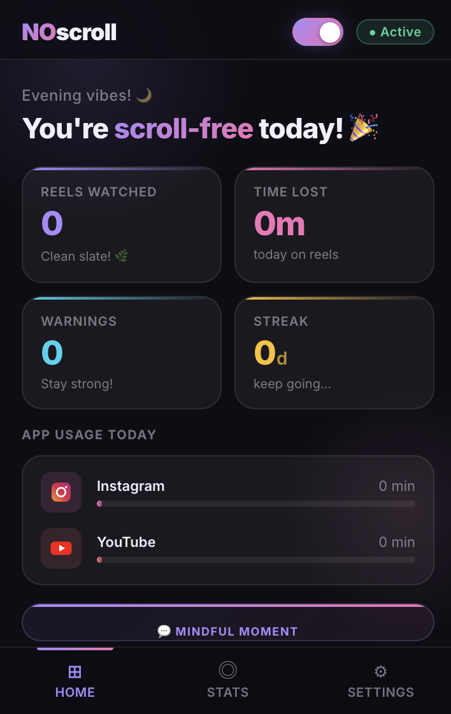
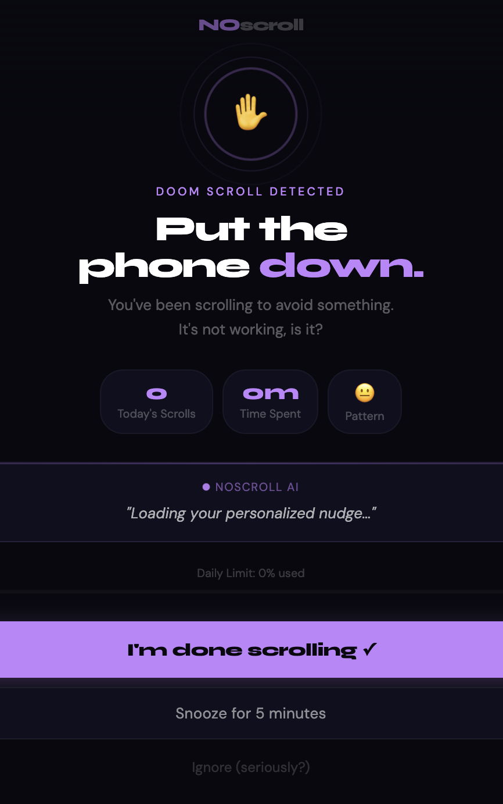
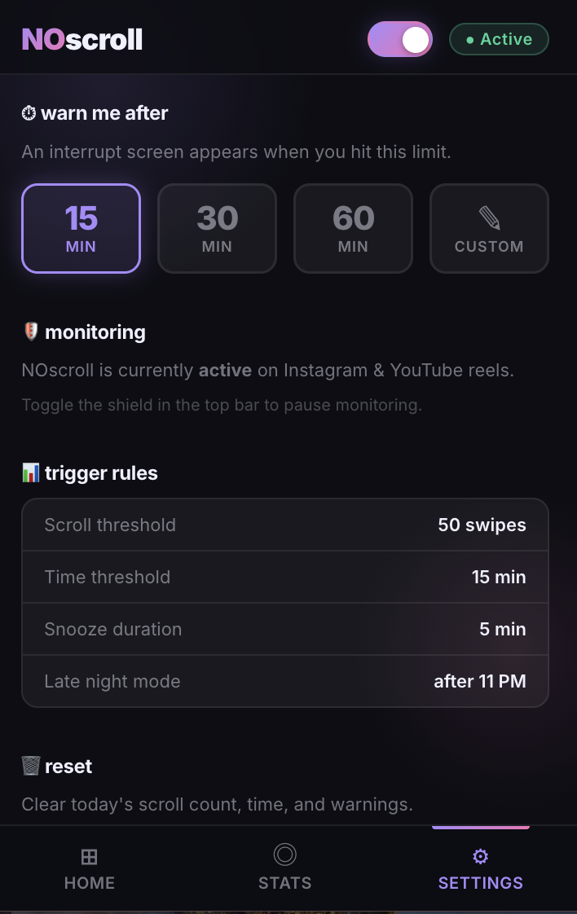

<div align="center">

# <em>NO</em>scroll

### *Stop doom scrolling. Understand why. Take back your time.*

**A Chrome Extension that detects doomscrolling on Instagram Reels & YouTube Shorts — and interrupts you with a full-screen AI-powered nudge before it's too late.**

[](https://github.com/vivekr43/NoScroll-)
[](https://instagram.com)
[](https://youtube.com)
[](https://github.com/vivekr43/NoScroll-)
[](LICENSE)

</div>

---

## 📸 Screenshots

| Dashboard | Interrupt Screen | Settings |
|---|---|---|
|  |  |  |

---

## 💡 Why NOscroll Exists

We've all been there. You open Instagram *"just for a second"* and look up 45 minutes later wondering what happened to your evening.

The problem isn't willpower — it's that these apps are **engineered to be addictive**. Instagram Reels and YouTube Shorts are infinite scroll machines optimized to keep your thumb moving. The algorithm knows exactly what to show you next.

**NOscroll fights back.**

It watches your scrolling behaviour in the background, tracks how long you've been on reels today, and when you cross your personal limit — it **throws up a full-screen shield** that forces you to pause, see your actual stats, and make a conscious choice about whether to continue.

---

## ✨ Features

### 🛡️ Smart Monitoring
- Silently tracks scrolling activity on **Instagram Reels** and **YouTube Shorts**
- Counts individual reel/video swipes throughout the day
- Tracks exact time spent on each platform with per-app breakdown

### 📊 Live Dashboard
- **Reels Watched** — how many you've swiped through today
- **Time Lost** — total minutes burned on short-form content
- **Warnings Fired** — how many times the interrupt screen has appeared
- **Streak** — consecutive days you've stayed under your limit

### ⏱️ Customisable Limits
- Preset options: **15 min / 30 min / 60 min**
- **Custom time limit** — type your own number of minutes
- Also triggers on scroll count: **50 swipes** triggers a warning
- Snooze: **5-minute grace period** if you're mid-video

### 🚨 Full-Screen Interrupt Shield
When your limit is hit, the entire screen is taken over with:
- A pulsing purple **stop ring** with animated rings
- Your live stats: scrolls, time spent, behavioral pattern
- An **AI-generated nudge** message tailored to your usage pattern (avoidance, boredom, late-night, etc.)
- A purple-to-pink **daily limit progress bar**
- Three choices: **Stop now / Snooze 5 min / Ignore (seriously?)**

### 💬 Mindful Moments
- Hourly-rotating **motivational quotes** in the dashboard popup
- Audio alert plays when the interrupt screen fires

### 🌙 Late-Night Mode
- Extra-sensitive behavior detection **after 11 PM**
- Pattern recognition for "late-night scrolling" behavior type

### 🎨 Premium UI
- **Glassmorphism** dark-mode popup with vibrant stat cards
- **Syne + DM Sans** typography for the interrupt screen
- Smooth animations and transitions throughout
- Zero external dependencies — fully vanilla

---

## 🚀 Installation (No Chrome Web Store Needed)

> NOscroll uses **Manifest V3** — the latest, most secure extension standard.

### Step 1 — Download the Extension
```bash
git clone https://github.com/vivekr43/NoScroll-.git
```

### Step 2 — Load in Chrome
1. Open Chrome and go to: **`chrome://extensions/`**
2. Enable **Developer Mode** (toggle in the top-right corner)
3. Click **"Load unpacked"**
4. Select the **`NOscroll`** folder (the one containing `manifest.json`)

### Step 3 — Pin & Activate
1. Click the puzzle piece 🧩 icon in Chrome toolbar
2. Pin **NOscroll** to your toolbar
3. The shield is **active by default** — you're protected!

> 💡 **That's it.** No accounts, no sign-ups, no data sent anywhere. Everything runs locally in your browser.

---

## 🧠 How It Works

```
You open Instagram/YouTube
         ↓
content.js detects scroll events
         ↓
background.js counts swipes + tracks time via chrome.alarms
         ↓
Threshold crossed? (50 swipes OR your time limit)
         ↓
Interrupt screen injected as a full-page overlay
         ↓
You see your stats + AI nudge → make a conscious choice
```

### Behavior Classification
NOscroll analyzes your usage pattern and labels it:
| Pattern | Trigger |
|---|---|
| 😴 Late-night scrolling | Active after 11 PM |
| 🔄 Avoidance scrolling | Reopened app multiple times quickly |
| 😑 Boredom scrolling | Long continuous session mid-day |
| ⚡ Habit loop | Short bursts repeated throughout day |

---

## 🛠️ Tech Stack

| Layer | Technology |
|---|---|
| **Extension Core** | Chrome Extension API (Manifest V3) |
| **Background Logic** | Service Worker (`background.js`) |
| **Content Injection** | Content Script (`content.js`) |
| **Popup UI** | HTML + CSS (Glassmorphism) + Vanilla JS |
| **Interrupt Screen** | Full-page HTML overlay |
| **Typography** | Inter (popup) · Syne + DM Sans (interrupt) |
| **Fonts** | Google Fonts |
| **Storage** | `chrome.storage.local` (all local, no server) |
| **Timers** | `chrome.alarms` API |

---

## 📁 Project Structure

```
NOscroll/
├── manifest.json          # Extension config (MV3)
├── background.js          # Service worker: scroll counting, alarms, state
├── content.js             # Injected into Instagram/YouTube: scroll detection
├── popup/
│   ├── popup.html         # Dashboard UI (3 tabs: Home, Stats, Settings)
│   ├── popup.css          # Dark glassmorphism styles
│   └── popup.js           # Dashboard logic, chrome.storage reads
├── interrupt/
│   ├── interrupt.html     # Full-screen stop screen
│   └── interrupt.js       # AI nudge logic, timer, stat display
├── styles/
│   └── shared.css         # Shared style tokens
└── icons/
    ├── icon16.png
    ├── icon48.png
    └── icon128.png
```

---

## 🔮 Planned Features

- [ ] **Weekly email digest** — summary of your scroll habits
- [ ] **Streak rewards** — unlock badges for clean days
- [ ] **Telegram/WhatsApp platforms** — extend monitoring coverage
- [ ] **Focus mode** — completely block access after N warnings
- [ ] **Pattern insights** — weekly breakdown of what triggers your scrolling
- [ ] **Custom nudge messages** — write your own interrupt messages
- [ ] **Dark/Light theme toggle** for the popup
- [ ] **Chrome Web Store release** (public distribution)

---

## 🔒 Privacy

**NOscroll collects zero data.** Full stop.

- Everything is stored in `chrome.storage.local` — on your device only
- No network requests are made by the extension itself
- No analytics, no telemetry, no account required
- Scroll counts and time data never leave your browser
- Open source — verify it yourself

---

## 🤝 Contributing

Got ideas? Found a bug? PRs are welcome.

1. Fork the repo
2. Create your feature branch: `git checkout -b feature/my-feature`
3. Commit your changes: `git commit -m 'Add my feature'`
4. Push to the branch: `git push origin feature/my-feature`
5. Open a Pull Request

---

## 📄 License

MIT License — free to use, modify, and share.

---

<div align="center">

Built with 💜 to reclaim attention in an age of distraction.

*"Your attention is the most valuable thing you own. Spend it wisely."*

</div>
